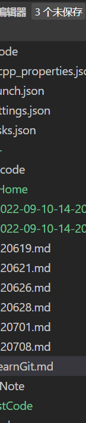

# Learn Git Branching
## git checkout [nodeName]
1. 将HEAD移动到指定的节点，输入分支名字的时，移动到分支所在的最新节点
2. 支持输入移位相关的操作 
   1. git checkout main^ 代表将HEAD节点移动到main节点的前一个位置处
   2. git checkout main~3 代表将HEAD节点移动到main节点的前3个位置处
## git switch [branchName]
1. 切换HEAD到某个特定节点处
2. checkout 操作也可以实现，但是更推荐使用switch
## git reset [nodeName]
1. reset操作将当前branch的最新位置移动到指定的位置，这个指令只是将指针记录的位置回退，并没有删除原本的记录，如果需要的话，还是可以重新取回该记录
2. 这只是在本地的reset，如果是远程多人协作，则请使用git reverse [nodeName]
## git reverse [nodeName]
1. 这个指令将提交一个新的commit 这个commit中的内容跟你指定的node的文件一样
2. 这样看上去就是线性的，也更好的
3. 