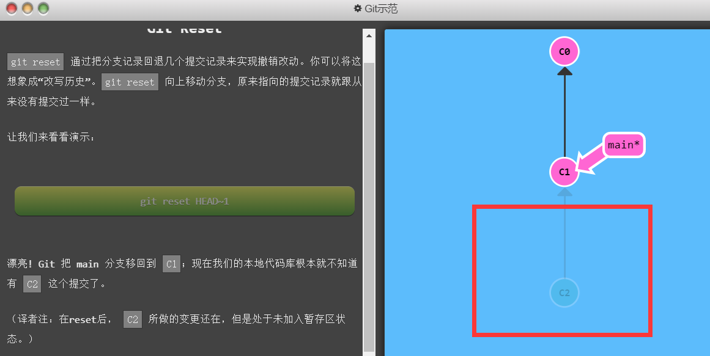
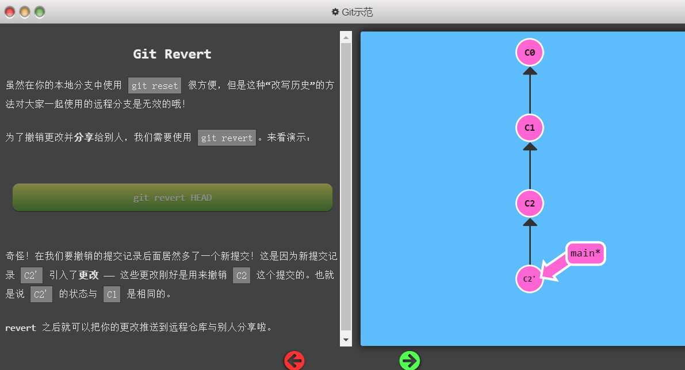
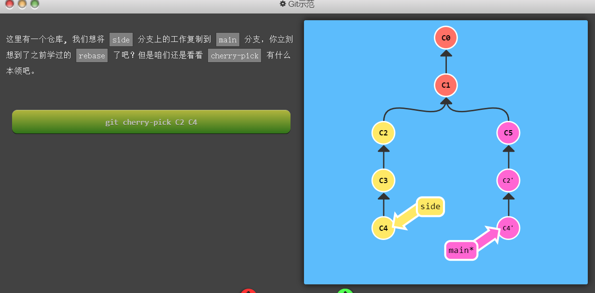
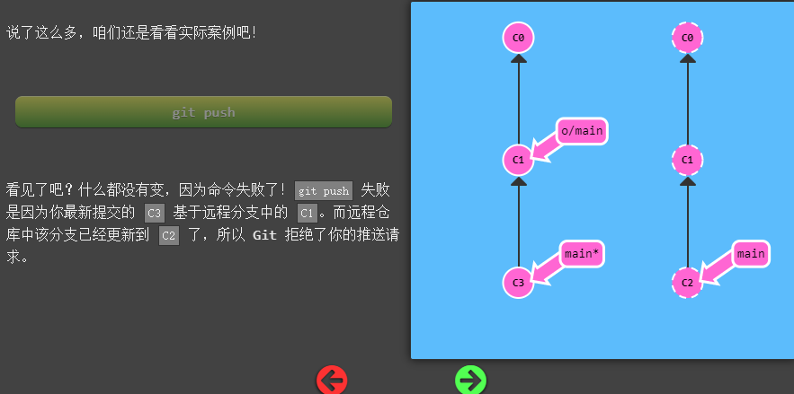

# Learn Git Branching（时刻注意HEAD指针的指向）
## git checkout [nodeName]
1. 将HEAD移动到指定的节点，输入分支名字的时，移动到分支所在的最新节点
2. 支持输入移位相关的操作 
   1. git checkout main^ 代表将HEAD节点移动到main节点的前一个位置处
   2. git checkout main~3 代表将HEAD节点移动到main节点的前3个位置处
## git switch [branchName]
1. 切换HEAD到某个特定节点处
2. checkout 操作也可以实现，但是更推荐使用switch
## git reset [nodeName]
1. reset操作将当前branch的最新位置移动到指定的位置，这个指令只是将指针记录的位置回退，并没有删除原本的记录，如果需要的话，还是可以重新取回该记录
2. 这只是在本地的reset，如果是远程多人协作，则请使用git reverse [nodeName]
  

## git revert [nodeName]
1. 这个指令将提交一个新的commit 这个commit中的内容跟你指定的node的文件一样
2. 这样看上去就是线性的，也更好的
3. 这个新的插入是在HEAD指针后面
  

## git cherry-pick
1. 这个命令可以将指定哈希值的提交插入到HEAD指针之后
  

## git rebase -i
1. 将某些位置的节点数据重排并且rebase到HEAD节点后面

## git commit --amend
1. 有时你提交过代码之后，发现一个地方改错了，你下次提交时不想保留上一次的记录；或者你上一次的commit message的描述有误，这时候你可以使用接下来的这个命令：git commit --amend

## git branch -f [branchNeedToMOove] [MoveTo]
1. 移动分支指针到指定位置
   
## git rebase
  

## git fetch
1. git fetch只是将远程中的东西下载到本地，并不会改变原本本地仓库的文件
2. fetch后会更新本地仓库中的远程仓库指针

## 远程仓库操作
### 偏移的工作记录
  
每次push，提交的仓库需要与远程的仓库在起始的地方保持一致