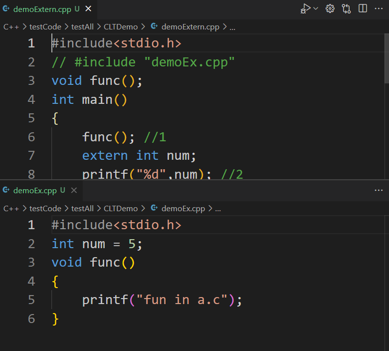
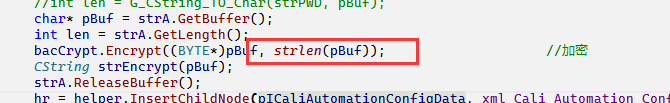

1. 关于浮点数的对比，切记使用减法进行比较
2. 三思而后行，先做好程序的思路再去写代码！！
3. 最开始的我的message是在直接send给LogDlg的方法中，但并没有指明是哪个对象，导致最后编译器报错，应该传给在manager里面创建好的对象，之后调用相应的sendmessage加载函数，需要send的message需要在LogDlg里面重写相应的处理函数
4. 消息机制是MFC编程的重要机制之一，谁发送消息，谁接收，相应的消息处理函数和消息宏定义
5. extern 关键字用于在给一个变量或者函数声明，告诉编译器先别急着报错，这个变量或者函数是在其他地方被定义的，详见下图：
  
6. ``sizeof()``求出里面表达式的大小，以字节为单位，但是要注意传进去的是指针还是一整个空间
```C++
    CString strPWD = it->m_strPassword;
    CStringA strA(strPWD);
    //char* pBuf = nullptr;
    //int len = G_CString_TO_Char(strPWD, pBuf);
    char* pBuf = strA.GetBuffer();
    int len = strA.GetLength();
    bacCrypt.Encrypt((BYTE*)pBuf, strlen(pBuf));					//加密
    CString strEncrypt(pBuf);
    strA.ReleaseBuffer();
```
  
7. MFC的初始化：https://blog.csdn.net/Lirx_Tech/article/details/48178811
8. dlg的初始化顺序，根据需要在对象实例化的时候利用外面的set对对象进行操作，首先是构造函数，之后是公共成员函数的set??
9. //https://blog.csdn.net/crazygougou/article/details/9389867 vector iterators incompatible
10. 在线性搜索的应用场景下可以考虑使用二分法，寻找左右边界
11. WaitForSingleObject的效果就相当于一个关卡，只有返回给了WaitForSingleObject结果程序才能继续执行，当然线程不一定能正常执行结束，也可能会出现，提前结束的情况，原因是给的等待时间结束了，但这个线程还是没有执行完，可以将WaitForSingleObject的第二个参数设置为 INFINITE，就可以一直等待。
12. 关于屏幕闪烁问题 参考：https://blog.csdn.net/ximi19881011/article/details/24941287
13. MFC双缓冲解决闪烁问题
    1.  双缓冲的原理可以这样形象的理解：把电脑屏幕看作一块黑板。首先我们在内存环境中建立一个“虚拟“的黑板，然后在这块黑板上绘制复杂的图形，等图形全部绘制完毕的时候，再一次性的把内存中绘制好的图形“拷贝”到另一块黑板（屏幕）上。采取这种方法可以提高绘图速度，极大的改善绘图效果。
    2.  参考：https://blog.csdn.net/xiaowang629/article/details/38946267
14. #define 后面只有一个参数，用法同define后接两个参数，只是后一个参数为空字符串。用途包括：
    1.  定义一个符号用来给#if(n)def判断。  
    2.  多文件编译中防止头文件被重复包含。
15. C++中的匿名对象是pure RValue, 因而不能作为引用传进去,匿名对象只存在于构造该对象的那行代码，离开构造匿名对象的哪行代码后立即调用析构函数。
16. 对于IDE，你输入的每一个文字它都需要帮你进行编码，这也是设置编码格式的意义所在
17. file的open在同一个文件，即使close了还是在一个文件中读写？？？
18. 单例模式复习。。。
19. C/S架构相关学习
20. 关于二分查找，利用搜索区间取避免漏掉元素，在实际的代码中表现形式为right的取值和终止条件[left,right] 其中``while(left<=right)``即left == right + 1的时候终止